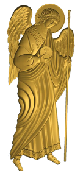

✨✨✨Connecting Angels to their respective Spectacular Entrepreneurial Spirits✨✨✨

✨✨✨since <em>2020!</em>✨✨✨

------- Frontend -------

AngularJs with Web3 GUI

"The Angel Room"

_________________________

<ul>
  <li>Manifestation: Access the backend Angel Token Solidity Smart-Contract from the Angel Room frontend in Angularjs App
       <ul>
         <li>Connect contract ABI by address via Web3</li>
         <li>fetch necessary contract variables to display tokens</li>
         <li>expose them to a user friendly GUI by wallet</li>
        </ul>
  </li>  
  <li>Jolly explains it All: Development frontend functionality to explain it all
      <ul>
        <li>-- TheGeneralStory();
              - The Why:
                  -general readable terms to just what the heck this is all about
                  -to heal the Earth nation, duh! #DoItForGreta
                  -links to facilitate understanding of cryptoToken, smart contracts, CrowdFunding, micro lending, and Angel Investing
        </li>
        <li>-- WhatsItAbout(); 
                - an explanation of what this angel token is representing
        </li>
        <li>-- NextTokenOffering(); the details of the next offering
               - the cost - the coffee weight shipped - and the dividend (percent profit share on next round)
        </li>
        <li>-- ThisTokenOffering(); the terms of this token offering
               - the cost - the coffee weight shipped - and the dividend (percent profit share on next round)
        </li>
        <li>-- LastTokenOffering();
               - terms of last offer to compare past executions to present offerings
        </li>
      </ul>
  </li>
  <li>Frontend executive functionality:
      <ul>
        <li>--BuyToken();
              - button for sprites to give alms and receive tokens
        </li>  
        <li>--CreateAngelCup();
              - if no account, create a Caffeine LaManna Angel Cup to hold tokens for the Angel when they buy them (Angels don't have pockets)
              - Unique Token Cup address is your "Wallet"
              - It holds tokens you purchase by pressing the "BuyTokens" button
              - Thats right! Every Angel will permanetly manifest in teh Ether and be remembered on the Angel's List!
        </li>  
        <li>--GetAngelPersonality(); 
              - enter your name, address, and contact information ( for regulatory purposes ).
              - Wallet Warning: Your wallet address is yours and yours only 
                -- DONT ASK ME TO "RECOVER" a lost one because I cannot!! It will be lost in the ether FOREVER if you lose it!
                -- we just use your address to display what tokens are associated with that address and to pay it back a share of the benefits!
        </li>  
        <li>--XChange();
              - exchange Dollars for ether and the ether for Token
        </li>
        <li>--TransferTokensToAngelCup();
              - Transfer Tokens to Angel Cup and out of Initial Supply
        </li>
        <li>--CheckBalance(); input "Angel Cup Address" (the connected wallet) to display the Tokens owned by the Angel's Cup
                - angelTokensInCup(address(AngelCup));
                   - the Angel Cup to display
                   - enter your address to see tokens (alms) you've minted for certain endeavors
        <li>-- almsGiven(address(SpriteCup);
               - represents tokens "owned" for the staunch capitalist
               - but angels and sprites refer to them as "alms" and they represent a "Blessing", or an act of giving toward an Endeavor
        </li>                      
        <li>-- productValue();
               - The value of your alms in some unit product (shipping included continental US)
        </li>
        <li>--divCoefficient();
               - The share an alm receives in return if the Next round executes successfuly
        </li>
        <li>-- DividendCashOut();
               - Withdraw Dividend after the next round has been executed for discounted Fresh Beans to you door!
        </li>
        <li>-- DisplayTokensRemaining();
               - the needed until the round is "executable" for a specific endeavor
        </li>
        <li>-- AngelTokenSupply
               - The amount of tokens left from the Initial 8 trillion Supply         
        </li>
      </ul>  
  </li>        
</ul>  

 do it all again for each endeavor until Earth is healed and situated properly in the cosmos again!
    - every startup endeavor has its Angels and its Sprites
    - an Angel is someone who mints tokens to endeavor to make life better for hunanity
    - a sprite is someone who supports an Angel's endeavor
    - All Angels are Sprites. Not every Sprite is an Angel - but Hey! At least they give!
    - An Angel Cup shows the Angel Tokens an Angel has minted when searchign for sprites to fuel an endeaver
    - A Sprite wallet shows the alms (units of different Angel Tokens) being fueled by a Sprite

------- Immutable Backend -------

Solidity Contract on Ethereum

""The Angel Offering""

_________________________

-- Stakes(); // describes profit break down and fund allocations for initialization of new round
              // Gives a name to the Current Round of Issuance, ie, "2020 Micro Mint" or "2020 Seed Round"
              // Sets limitations on how many tokens can be owned by any one party(by name and address, not by wallet)
              // Sets Angel's Share of next profit per token
              // Sets Angel's Bean Reward per token when round executes (All tokens are sold(all angels present at Council))
              // Sets estimated shipping amount to be reserved on execution
              // - Shipping - Beans - Dividend Payout(profitshare) - Roaster Profit
              // for seeding a $10K MicroRound: $3500 - $2500 - $0(0.0005%) - $4000
              // for the First $10K Micro Mint: $3500 - $2500 - $2000(0.0005) - $2000
              // Sets RoastMeisterAllocation

-- ExecuteContract(); // When all tokens are sold, contract emails RoastMeister to Verify the Offering
                      // RoastMeister Enters unique key to Verify Angel Council's Order
                      ReleaseToRoaster();// Funds are released to RoastMeister's account to purchase beans and use Profit
                      RewardDividend();// Funds are released to Reward last rounds Angels with Cash payout according to the share they bought into (tokens*profitshare)
                      ShippingEscrow();// Funds remain locked for shipping cost

-- CreateAngelCup(); // backend to create unique wallet for Angel ("the Angel's Cup")
                      // enters Angel onto AngelCouncil();

-- AngelCouncil(); // Immutable distributed ledger of the Angels who hold tokens for the Unique Issue
                    // Angel Name, Address, Public Wallet Address, amount of tokens owned, terms of unique token, Year Issued

-- Buy Tokens(); // make sure owner doesn't already have max amount allowable
                 // issue tokens with input information from frontend form

-- DividendCashOut(); exchanges earned dividend at the store for coffee shipped to your door!

-- AngelsMustered(); // executes when all tokens are bought;
                       // releases BeanReserve();
                       // releases RoastMeisterAllocation();
                       // releases RewardDividend(); from last contract;

-- BeanReserve();  // amount set aside for beans available on execution to RoastMeister

-- ShippingEscrow(); // reserves a portion of the raised funds to estimated shipping costs

-- RoasterWithdrawal();
      // doesn't allow RoastMeister to withdraw the Angel's Reward owed from last round
      // doesn't allow RoastMeister to withdraw funds needed for beans until all tokens are sold
      // doesn't allow RoastMeister to withdraw funds estimated for shipping
      // Allows RoastMeister to:
                withdraw funds designated as Roaster Profit as soon as all tokens are sold and contract becomes executable
                withdraw Bean Fund to order beans
                withdraw ShippingEscrow when all beans have been shipped
-- RewardDividend();
      // When next round is executed, call AngelCouncil() for list of Angels from last round and reward payout to angel's according to token ownership terms
      //
-- KillContract(); // if not enough Angel's bring their Cups to Council,
                      the round will not be executed,
                      all pledges will be refunded,
                      no dividends owed to last round until successful Mustering of Angels

-- DestroyParent(); // kill the last contract once all Angel's are rewarded their respective dividends
